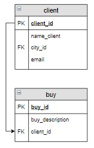

# База данных «Интернет-магазин книг», запросы корректировки

# Содержание
[Запрос на добавление, занесение констант и данные из других таблиц](#T1)<br>
[Запрос на обновление, UPDATE](#T2)<br>
[Создание таблицы, занесение констант и данные из других таблиц CREATE](#T3)<br>
[Запрос на добавление, занесение констант и данные из других таблиц JOIN](#T4)<br>
<br>

<a name="T1"></a>
# Запрос на добавление, занесение констант и данные из других таблиц

В запросах на добавление можно одновременно заносить и константы, и данные из других таблиц. В части запроса `INSERT` , где задается запрос на выборку, в качестве полей для вставки указываются не только поля других таблиц, но и  константы:

```sql
INSERT INTO ... 
SELECT 'Попов Илья', city_id, 'popov@test'
FROM city
WHERE ...;
```


### **Пример**

Включить нового человека в таблицу с клиентами. Его имя **Попов Илья**, его **email popov@test**, проживает он в **Москве**.


```sql
INSERT INTO client (name_client, city_id, email)
SELECT 'Попов Илья', city_id, 'popov@test'
FROM city
WHERE name_city = 'Москва';

SELECT * FROM client;
```
<br>

### **Пример**

Создать новый заказ для **Попова Ильи**. Его комментарий для заказа: «Связаться со мной по вопросу доставки».



```sql
INSERT INTO buy (buy_description, client_id)
SELECT 'Связаться со мной по вопросу доставки', client_id
FROM client
WHERE name_client = 'Попов Илья';

SELECT * FROM buy;
```
___
<br>

<a name="T2"></a>
# Запрос на обновление, UPDATE

### **Пример**

Количество тех книг на складе, которые были включены в заказ с номером 5, уменьшить на то количество, которое в заказе с номером 5  указано.


```sql
UPDATE book b
JOIN buy_book bb USING(book_id)
    SET b.amount = b.amount - bb.amount
WHERE buy_id = 5;

SELECT * FROM book;
```
___
<br>

# Создание таблицы, занесение констант и данные из других таблиц CREATE

### **Пример**

Создать счет (таблицу `buy_pay`) на оплату заказа с номером 5, в который включить название книг, их автора, цену, количество заказанных книг и  стоимость. Последний столбец назвать `Стоимость`. Информацию в таблицу занести в отсортированном по названиям книг виде.


```sql
CREATE TABLE buy_pay AS
SELECT title, name_author, price, bb.amount, price * bb.amount AS 'Стоимость'
FROM buy_book bb
    JOIN book b USING(book_id)
    JOIN author a USING(author_id)
WHERE bb.buy_id = 5
ORDER BY 1;

SELECT * FROM buy_pay;
```
<br>

### **Пример**

Создать общий счет (таблицу `buy_pay`) на оплату заказа с номером 5. Куда включить номер заказа, количество книг в заказе (название столбца `Количество`) и его общую стоимость (название столбца `Итого`). Для решения используйте ОДИН запрос.


```sql
CREATE TABLE buy_pay AS
SELECT buy_id, SUM(bb.amount) AS 'Количество', 
        SUM(price * bb.amount) AS 'Итого'
FROM buy_book bb
    JOIN book b USING(book_id)
WHERE buy_id = 5
GROUP BY 1;

SELECT * FROM buy_pay;
```
___

<br>

# Запрос на добавление, занесение констант и данные из других таблиц JOIN

### **Пример** 

В таблицу `buy_step` для заказа с номером 5 включить все этапы из таблицы `step`, которые должен пройти этот заказ. В столбцы `date_step_beg` и `date_step_end` всех записей занести `Null`.

```sql
INSERT INTO buy_step (buy_id, step_id)
SELECT buy_id, step_id
FROM buy
    CROSS JOIN step
WHERE buy_id = 5;

SELECT * FROM buy_step;
```
___

### **Пример** 
В таблицу buy_step занести дату 12.04.2020 выставления счета на оплату заказа с номером 5.

```sql
UPDATE buy_step JOIN step USING(step_id)
SET date_step_beg = '2020-04-12'
WHERE buy_id = 5 AND name_step = 'Оплата';

SELECT * FROM buy_step
WHERE buy_id = 5;

+-------------+--------+---------+---------------+---------------+
| buy_step_id | buy_id | step_id | date_step_beg | date_step_end |
+-------------+--------+---------+---------------+---------------+
| 17          | 5      | 1       | 2020-04-12    | NULL          |
| 18          | 5      | 2       | NULL          | NULL          |
| 19          | 5      | 3       | NULL          | NULL          |
| 20          | 5      | 4       | NULL          | NULL          |
+-------------+--------+---------+---------------+---------------+

```
___

### **Задание из комментариев**
1. Удалить из базы данных (таблицы buy, buy_step, buy_book) сведения о заказах, оплата которых не произведена или завершилась позднее суток с даты размещения заказа
(чтобы получить заказ с поздней оплатой, установим для заказа 1 дату оплаты '2020-03-03')

2. Перед удалением информации из таблицы buy_book перенести количество зарезервированных под заказ книг (поле amount таблицы buy_book) обратно на склад (поле amount таблицы book)

```sql
UPDATE buy_step
SET date_step_end = '2020-03-03'
WHERE buy_id = 1 AND step_id = 1;

UPDATE book JOIN buy_book USING(book_id)
SET book.amount = book.amount + buy_book.amount
WHERE buy_id IN (
    SELECT buy_step.buy_id
    FROM buy_step
    WHERE step_id = 1 AND (date_step_end IS NULL OR DATEDIFF(date_step_end,date_step_beg) >= 1)
);

DELETE FROM buy
WHERE buy_id IN (
    SELECT buy_step.buy_id
    FROM buy_step
    WHERE step_id = 1 AND (date_step_end IS NULL OR DATEDIFF(date_step_end,date_step_beg) >= 1)
);

SELECT * FROM buy;
SELECT * FROM buy_book;
SELECT * FROM buy_step;
SELECT * FROM book;

+--------+---------------------------------------+-----------+
| buy_id | buy_description                       | client_id |
+--------+---------------------------------------+-----------+
| 2      | NULL                                  | 3         |
| 3      | Упаковать каждую книгу по отдельности | 2         |
+--------+---------------------------------------+-----------+
Affected rows: 2

Query result:
+-------------+--------+---------+--------+
| buy_book_id | buy_id | book_id | amount |
+-------------+--------+---------+--------+
| 4           | 2      | 8       | 2      |
| 5           | 3      | 3       | 2      |
| 6           | 3      | 2       | 1      |
| 7           | 3      | 1       | 1      |
+-------------+--------+---------+--------+
Affected rows: 4

Query result:
+-------------+--------+---------+---------------+---------------+
| buy_step_id | buy_id | step_id | date_step_beg | date_step_end |
+-------------+--------+---------+---------------+---------------+
| 5           | 2      | 1       | 2020-02-28    | 2020-02-28    |
| 6           | 2      | 2       | 2020-02-29    | 2020-03-01    |
| 7           | 2      | 3       | 2020-03-02    | NULL          |
| 8           | 2      | 4       | NULL          | NULL          |
| 9           | 3      | 1       | 2020-03-05    | 2020-03-05    |
| 10          | 3      | 2       | 2020-03-05    | 2020-03-06    |
| 11          | 3      | 3       | 2020-03-06    | 2020-03-11    |
| 12          | 3      | 4       | 2020-03-12    | NULL          |
+-------------+--------+---------+---------------+---------------+
Affected rows: 8

Query result:
+---------+-----------------------+-----------+----------+--------+--------+
| book_id | title                 | author_id | genre_id | price  | amount |
+---------+-----------------------+-----------+----------+--------+--------+
| 1       | Мастер и Маргарита    | 1         | 1        | 670.99 | 4      |
| 2       | Белая гвардия         | 1         | 1        | 540.50 | 5      |
| 3       | Идиот                 | 2         | 1        | 460.00 | 11     |
| 4       | Братья Карамазовы     | 2         | 1        | 799.01 | 3      |
| 5       | Игрок                 | 2         | 1        | 480.50 | 11     |
| 6       | Стихотворения и поэмы | 3         | 2        | 650.00 | 15     |
| 7       | Черный человек        | 3         | 2        | 570.20 | 8      |
| 8       | Лирика                | 4         | 2        | 518.99 | 2      |
+---------+-----------------------+-----------+----------+--------+--------+

```
___
