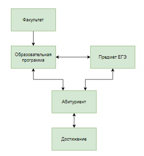
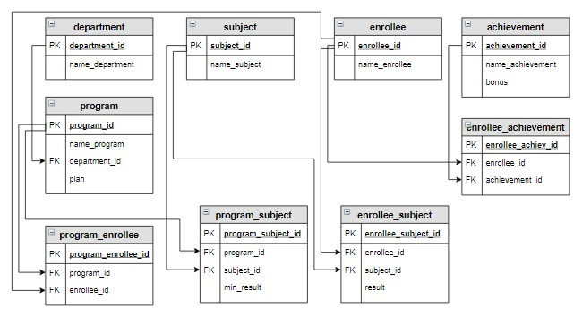

## База данных «Абитуриент», запросы на выборку

### Содержание
[Запрос на добавление, занесение констант и данные из других таблиц](#T1)<br>
[Запрос на обновление, UPDATE](#T2)<br>
[Создание таблицы, занесение констант и данные из других таблиц CREATE](#T3)<br>
[Запрос на добавление, занесение констант и данные из других таблиц JOIN](#T4)<br>
<br>







<a name="T1"></a>
### Задание

Выведите количество абитуриентов, сдавших ЕГЭ по каждому предмету, максимальное, минимальное и среднее значение баллов по предмету ЕГЭ. Вычисляемые столбцы назвать Количество, Максимум, Минимум, Среднее. Информацию отсортировать по названию предмета в алфавитном порядке, среднее значение округлить до одного знака после запятой.

```sql
SELECT name_subject, COUNT(enrollee_id) AS Количество, MAX(result) AS Максимум, MIN(result) AS Минимум, 
   ROUND(SUM(result) / COUNT(result) , 1) AS Среднее
FROM enrollee_subject JOIN subject USING(subject_id)
GROUP BY 1
ORDER BY 1;

+--------------+------------+----------+---------+---------+
| name_subject | Количество | Максимум | Минимум | Среднее |
+--------------+------------+----------+---------+---------+
| Информатика  | 4          | 94       | 75      | 82.0    |
| Математика   | 6          | 92       | 67      | 75.3    |
| Русский язык | 6          | 90       | 65      | 77.5    |
| Физика       | 5          | 90       | 41      | 69.8    |
+--------------+------------+----------+---------+---------+
```


### **Пример**
