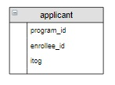

##### База данных «Абитуриент», запросы корректировки

### Содержание
[Повысить итоговые баллы абитуриентов в таблице applicant на значения ИД](#T1)<br>
[Зачислить студентов на приоритетные для них направления в соответствии с рейтингом](#T2)<br>
<br>

<a name="T1"></a>
### Задание

Повысить итоговые баллы абитуриентов в таблице applicant на значения дополнительных баллов (использовать запрос из предыдущего урока).

### Фрагмент логической схемы базы данных:


### Структура корректируемой таблицы:



### Пояснение
1. В запросах на обновление можно использовать несколько связанных таблиц. Например, чтобы обновить поле `itog` таблицы `applicant` для записей, относящихся к образовательной программе «Прикладная механика», используется запрос:

`UPDATE 
    applicant
    INNER JOIN program ON applicant.program_id = program.program_id
SET itog = 2
WHERE name_program = "Прикладная механика";`

2. В нашем случае вместо таблицы program можно использовать вложенный запрос, в котором посчитаны дополнительные баллы абитуриентов. А в качестве условия соединения таблиц после ключевого слова `ON` указать, что `id` абитуриентов в таблице `applicant` и во вложенном запросе совпадают.


```sql
UPDATE applicant a
    JOIN (
        SELECT enrollee_id, IF(SUM(bonus) IS NULL, 0, SUM(bonus)) AS sum_bonus
            FROM enrollee_achievement
            LEFT JOIN achievement USING(achievement_id)
        GROUP BY 1) B ON a.enrollee_id = B.enrollee_id
SET itog = itog + sum_bonus;

SELECT * FROM applicant;

+------------+-------------+------+
| program_id | enrollee_id | itog |
+------------+-------------+------+
| 1          | 3           | 235  |
| 1          | 2           | 226  |
| 1          | 1           | 219  |
| 2          | 6           | 276  |
| 2          | 3           | 235  |
| 2          | 2           | 226  |
| 3          | 6           | 270  |
| 3          | 4           | 239  |
| 3          | 5           | 200  |
| 4          | 6           | 270  |
| 4          | 3           | 247  |
| 4          | 5           | 200  |
+------------+-------------+------+

```
<a name="T1"></a>
### Задание
Зачислить студентов на приоритетные для них направления в соответствии с рейтингом. 
Считать, что студенты выбрали приоритетным направление, которое указано для них первым в таблице program_enrollee.
Вывести названия программ и зачисленных на них студентов, вакантные места на программах.

```sql

ALTER TABLE program_enrollee ADD Выбор INT;

SET @pr :=0;
SET @row :=0;
UPDATE program_enrollee
SET Выбор = IF(enrollee_id = @pr, @row := @row + 1, @row := 1 AND @pr := enrollee_id);

CREATE TABLE applicant AS
SELECT program_enrollee_id AS pe_id, program_id, pe.enrollee_id, name_enrollee, 
    IF(B.bonus IS NULL, SUM(es.result), SUM(es.result) + B.bonus) AS Итог, plan
FROM enrollee e
    JOIN program_enrollee pe USING(enrollee_id)
    JOIN program USING(program_id)
    JOIN program_subject ps USING(program_id)
    JOIN enrollee_subject es ON es.enrollee_id = pe.enrollee_id AND ps.subject_id=es.subject_id 
    LEFT JOIN (SELECT enrollee_id, SUM(bonus) as bonus
           FROM enrollee_achievement
           INNER JOIN achievement USING(achievement_id)
           GROUP BY 1) AS B ON B.enrollee_id=es.enrollee_id
WHERE program_enrollee_id NOT IN (
    SELECT program_enrollee_id
    FROM program_enrollee pe
    INNER JOIN program_subject ps USING(program_id)
    INNER JOIN enrollee_subject es ON es.subject_id = ps.subject_id AND es.enrollee_id = pe.enrollee_id
WHERE result < min_result)
GROUP BY 2, 3, 4, 1, B.bonus
ORDER BY 2, 5 DESC
;

ALTER TABLE applicant ADD Рейтинг INT;
ALTER TABLE applicant ADD Выбор INT;
ALTER TABLE applicant ADD Зачисление INT;

/* Установить рейтинг зачисляемых на каждую программу */

SET @p :=0;
SET @r :=0;
UPDATE applicant
SET Рейтинг = IF(program_id = @p, @r := @r + 1, @r := 1 AND @p := program_id);

/*Из таблицы перенести приоритетность программ для самих поступающих, исходя из того, что выше в списке указаны более приоритетные для них программы. */

UPDATE applicant a
    JOIN program_enrollee pe ON pe.enrollee_id = a.enrollee_id AND pe.program_id = a.program_id
SET a.Выбор = pe.Выбор;

/* Если для студента программа является выбором №1 и он в "зеленой волне" (его рейтинг <= плану набора программы) - зачислить студента на программу */

UPDATE applicant
SET Зачисление = 1
WHERE Рейтинг <= plan AND Выбор = 1;

/*Создать вспомогательную таблицу enrollment (Зачисление) */

CREATE TABLE enrollment AS
SELECT pe_id, a.program_id, name_enrollee, Зачисление
FROM applicant a
    JOIN program_enrollee pe ON pe.program_id = a.program_id AND pe.enrollee_id = a.enrollee_id;

/* Удалить из листа ожидания других программ студентов, которые уже зачислены на свое приоритетное направление. */

DELETE FROM enrollment
WHERE name_enrollee IN (
    SELECT name_enrollee
    FROM applicant
    WHERE Зачисление = 1
    ) AND pe_id NOT IN (
        SELECT pe_id
        FROM applicant
        WHERE Зачисление = 1
        );

DELETE FROM applicant
WHERE pe_id NOT IN (
    SELECT pe_id
    FROM enrollment);

/*Пересчитать рейтинг оставшихся в листе ожидания */

SET @p :=0;
SET @r :=0;
UPDATE applicant
SET Рейтинг = IF(program_id = @p, @r := @r + 1, @r := 1 AND @p := program_id);

/* Снова зачислить тех, кто теперь вошел в зеленую волну на своей приоритетной программе */

UPDATE applicant
SET Зачисление = 1
WHERE Рейтинг <= plan AND Выбор = 1;

UPDATE enrollment
SET Зачисление = 1
WHERE pe_id IN (
    SELECT pe_id
    FROM applicant
    WHERE Зачисление = 1
    );

/* Повторяем шаги с удалением зачисленных с других программ */

DELETE FROM enrollment
WHERE name_enrollee IN (
    SELECT name_enrollee
    FROM applicant
    WHERE Зачисление = 1
    ) AND pe_id NOT IN (
        SELECT pe_id
        FROM applicant
        WHERE Зачисление = 1
        );

DELETE FROM applicant
WHERE pe_id NOT IN (
    SELECT pe_id
    FROM enrollment);

SET @p :=0;
SET @r :=0;
UPDATE applicant
SET Рейтинг = IF(program_id = @p, @r := @r + 1, @r := 1 AND @p := program_id);

/* С тех программ, где заполнены места, удалить лист ожидания */
UPDATE applicant
SET Зачисление = 0
WHERE Зачисление IS NULL;

UPDATE enrollment
SET Зачисление = 0
WHERE Зачисление IS NULL;

DELETE FROM enrollment
WHERE program_id IN (SELECT program_id
                     FROM (
    SELECT program_id, plan, SUM(Зачисление)
    FROM applicant
    GROUP BY 1, 2
    HAVING plan <= SUM(Зачисление))P
                    )
    
    AND pe_id NOT IN (
        SELECT pe_id
        FROM applicant
        WHERE Зачисление = 1
        );

DELETE FROM applicant
WHERE pe_id NOT IN (
    SELECT pe_id
    FROM enrollment); 

/* Зачислить студентов на программы с наивысшим для них приоритетом */
UPDATE applicant
SET Зачисление = 1
WHERE Рейтинг <= plan AND Выбор = (SELECT MIN(Выбор) FROM
    (SELECT name_enrollee, MIN(Выбор)
    FROM applicant
    GROUP BY 1) v );
    
UPDATE enrollment
SET Зачисление = 1
WHERE pe_id IN (
    SELECT pe_id
    FROM applicant
    WHERE Зачисление = 1
    );
    

/* С тех программ, где заполнены места, удалить лист ожидания */

DELETE FROM enrollment
WHERE program_id IN (SELECT program_id
                     FROM (
    SELECT program_id, plan, SUM(Зачисление)
    FROM applicant
    GROUP BY 1, 2
    HAVING plan <= SUM(Зачисление))P
                    )
    
    AND pe_id NOT IN (
        SELECT pe_id
        FROM applicant
        WHERE Зачисление = 1
        );

DELETE FROM applicant
WHERE pe_id NOT IN (
    SELECT pe_id
    FROM enrollment); 
    
SELECT * FROM applicant;
SELECT * FROM enrollment; 

/* Вывести названия программ и зачисленных на них студентов, вакантные места на программах */

CREATE TABLE admission_letter AS
SELECT name_program, name_enrollee
FROM program
    LEFT JOIN enrollment USING(program_id)
ORDER BY 1;
    
SELECT * FROM admission_letter;

+-------+------------+-------------+-----------------+------+------+---------+-------+------------+
| pe_id | program_id | enrollee_id | name_enrollee   | Итог | plan | Рейтинг | Выбор | Зачисление |
+-------+------------+-------------+-----------------+------+------+---------+-------+------------+
| 6     | 1          | 3           | Семенов Иван    | 235  | 2    | 1       | 1     | 1          |
| 5     | 1          | 2           | Абрамова Катя   | 226  | 2    | 2       | 2     | 1          |
| 12    | 2          | 6           | Степанова Дарья | 276  | 1    | 1       | 1     | 1          |
| 9     | 3          | 4           | Яковлева Галина | 239  | 2    | 1       | 1     | 1          |
| 10    | 3          | 5           | Попов Илья      | 200  | 2    | 2       | 1     | 1          |
+-------+------------+-------------+-----------------+------+------+---------+-------+------------+

+-------+------------+-----------------+------------+
| pe_id | program_id | name_enrollee   | Зачисление |
+-------+------------+-----------------+------------+
| 6     | 1          | Семенов Иван    | 1          |
| 5     | 1          | Абрамова Катя   | 1          |
| 12    | 2          | Степанова Дарья | 1          |
| 9     | 3          | Яковлева Галина | 1          |
| 10    | 3          | Попов Илья      | 1          |
+-------+------------+-----------------+------------+

+-------------------------------------+-----------------+
| name_program                        | name_enrollee   |
+-------------------------------------+-----------------+
| Математика и компьютерные науки     | Степанова Дарья |
| Мехатроника и робототехника         | NULL            |
| Прикладная математика и информатика | Абрамова Катя   |
| Прикладная математика и информатика | Семенов Иван    |
| Прикладная механика                 | Попов Илья      |
| Прикладная механика                 | Яковлева Галина |
+-------------------------------------+-----------------+

```
