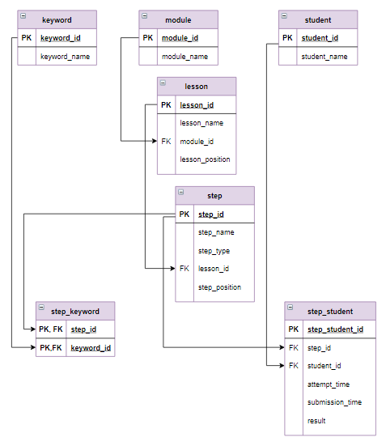
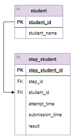
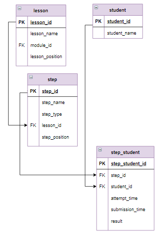

# База данных "Учебная аналитика по курсу"

# Содержание
[Навигатор по шагам курса](#T1)<br>
[Заполнение таблицы для навигации по ключевым словам](#T2)<br>
[Поиск по ключевым словам](#T3)<br>
[Выборка данных по нескольким условиям, оператор CASE](#T4)<br>
[Табличные выражения, оператор WITH](#T5)<br>
[Задание, вычисление прогресса пользователей](#T6)<br>
[Оконные функции, оператор OVER, ORDER BY](#T7)<br>
[Задание, среднее время выполнения урока](#T8)<br>
[Оконные функции, оператор OVER, PARTITION BY](#T9)<br>
[Задание, периодичность работы обучающегося с курсом](#T10)<br>
[Задание, статистика по всем попыткам обучающегося](#T11)<br>
<br>

### Логическая схема базы данных :



<a name="T1"></a>

# Навигатор по шагам курса

Платформа Stepik представляет довольно скудную навигацию по шагам модуля. Очень трудно вспомнить, на каком шаге изучался тот или иной материал. База данных этого урока позволяет с помощью запросов реализовать удобный поиск нужных шагов.

### Задание
Отобрать все шаги, в которых рассматриваются вложенные запросы (то есть в названии шага упоминаются вложенные запросы). Указать к какому уроку и модулю они относятся. Для этого вывести 3 поля:

в поле Модуль указать номер модуля и его название через пробел;
в поле Урок указать номер модуля, порядковый номер урока (lesson_position) через точку и название урока через пробел;
в поле Шаг указать номер модуля, порядковый номер урока (lesson_position) через точку, порядковый номер шага (step_position) через точку и название шага через пробел.
Длину полей Модуль и Урок ограничить 19 символами, при этом слишком длинные надписи обозначить многоточием в конце (16 символов - это номер модуля или урока, пробел и  название Урока или Модуля к ним присоединить "..."). Информацию отсортировать по возрастанию номеров модулей, порядковых номеров уроков и порядковых номеров шагов.

Фрагмент логической схемы базы данных:


```sql
SELECT CONCAT(module_id, " ", LEFT(module_name, 14), "...") AS Модуль,
    CONCAT(module_id, ".", lesson_position, " ", LEFT(lesson_name, 12), "...") AS Урок,
    CONCAT(module_id, ".", lesson_position, ".", step_position, " ", step_name) AS Шаг
FROM module
    JOIN lesson USING(module_id)
    JOIN step USING(lesson_id)
WHERE step_name LIKE "%вложенн%запрос%"
ORDER BY 1, 2, 3;

+---------------------+---------------------+-------------------------------------------------------------+
| Модуль              | Урок                | Шаг                                                         |
+---------------------+---------------------+-------------------------------------------------------------+
| 1 Основы реляцио... | 1.4 Вложенные за... | 1.4.2 Вложенный запрос, возвращающий одно значение          |
| 1 Основы реляцио... | 1.4 Вложенные за... | 1.4.3 Использование вложенного запроса в выражении          |
| 1 Основы реляцио... | 1.4 Вложенные за... | 1.4.4 Вложенный запрос, оператор IN                         |
| 1 Основы реляцио... | 1.4 Вложенные за... | 1.4.5 Вложенный запрос, операторы ANY и ALL                 |
| 1 Основы реляцио... | 1.4 Вложенные за... | 1.4.6 Вложенный запрос после SELECT                         |
| 1 Основы реляцио... | 1.5 Запросы корр... | 1.5.5 Добавление записей, вложенные запросы                 |
| 2 Запросы SQL к ... | 2.2 Запросы на в... | 2.2.7 Запросы для нескольких таблиц со вложенными запросами |
| 2 Запросы SQL к ... | 2.2 Запросы на в... | 2.2.8 Вложенные запросы в операторах соединения             |
| 2 Запросы SQL к ... | 2.3 Запросы корр... | 2.3.5 Запрос на обновление, вложенные запросы               |
+---------------------+---------------------+-------------------------------------------------------------+

```

<a name="T2"></a>

# Заполнение таблицы для навигации по ключевым словам.

Еще одна возможность улучшить навигацию по курсу - это реализация поиска шагов по ключевым словам. Для этого необходимо создать таблицу с терминами keyword, а затем связать ее с таблицей step через вспомогательную таблицу step_keyword. Каждая запись этой таблицы - это id шага и id встречающегося на этом шаге ключевого слова.

### **Задание**

Заполнить таблицу step_keyword следующим образом: если ключевое слово есть в названии шага, то включить в step_keyword строку с id шага и id ключевого слова. 

Фрагмент логической схемы базы данных:


### Пояснение

1. Чтобы проверить, есть ли ключевое слово в заголовке шага, можно использовать функцию:

INSTR(string_1, string_2)
которая возвращает позицию первого вхождения string_2 в string_1. Если вхождения нет - результат функции 0.

2. Обратите внимание, что некоторые ключевые слова, например IN, входят в INNER и JOIN. Нужно учитывать только отдельные слова, которые разделены в названии шага либо пробелом, либо запятой, либо открывающей скобкой.

3. Это задание можно решить с помощью регулярных выражений (комментарий  Алексея Карелина) или с помощью функции REGEXP_INSTR (комментарий Yury Popov).

### комментарий  Алексея Карелина:

REGEXP позволяет задать регулярное выражение, которому должно соответствовать значение столбца. В этом плане REGEXP представляет более изощренный и комплексный способ фильтрации, нежели оператор LIKE. Это <a href="https://dev.mysql.com/doc/refman/8.0/en/regexp.html#regexp-syntax">ссылка</a> на документацию.

REGEXP имеет похожий синтаксис:

`WHERE выражение [NOT] REGEXP регулярное выражение`

Регулярное выражение может принимать следующие специальные символы:

`^`   указывает на начало строки

`$`   указывает на конец строки

`.`    соответствует любому одиночному символу

`[символы]`    соответствует любому одиночному символу из квадратных скобок

`[начальный_символ-конечный_символ]` соответствует любому одиночному символу из диапазона символов

`|`     отделяет два шаблона строки, и значение должно соответствовать одному из этих шаблонов

Примеры REGEXP:

<ul>
<li>WHERE ProductName REGEXP 'Phone': строка должна содержать "Phone", например, iPhone X, Nokia Phone N, iPhone</li>

<li>WHERE ProductName REGEXP '^Phone': строка должна начинаться с "Phone", например, Phone 34, PhoneX</li>

<li>WHERE ProductName REGEXP 'Phone$': строка должна заканчиваться на "Phone", например, iPhone, Nokia Phone</li>

<li>WHERE ProductName REGEXP 'iPhone [78]';: строка должна содержать либо iPhone 7, либо iPhone 8</li>

<li>WHERE ProductName REGEXP 'iPhone [6-8]';: строка должна содержать либо iPhone 6, либо iPhone 7, либо iPhone 8</li>
</ul> 

Например, найдем товары, названия которых содержат либо "Phone", либо "Galaxy":
```sql
SELECT * FROM Products

WHERE ProductName REGEXP 'Phone|Galaxy';
```

### комментарий Yury Popov:

`REGEXP_INSTR(string, pat)` делает то же самое, что и `INSTR(string1, string2)`, только вторым аргументом можно подставить регулярное выражение. Символ конца слова надо набирать так: `\\b`

Символ `\\b` применяется только в регулярных выражениях.

Символ `\\b` в SQL используется, чтобы обозначить границу слова, с которым этот символ используется.

То есть, этот символ указывает на то, что искомая подстрока отделена в строке либо пробелом, либо знаками препинания, либо находится в начале или конце строки.

Если `\\b` стоит в начале подстроки, например `"\\bIN"`, то регулярное выражение отберёт все строки, в которых перед IN стоит либо пробел, либо знаки препинания, либо строка начинается с IN ("INNER" также попадёт в выборку).

Если `\\b` стоит в конце подстроки, например `"IN\\b"`, то регулярное выражение отберёт все строки, в которых после IN стоит либо пробел, либо знаки препинания, либо строка заканчивается на IN ("INNER" в выборку не попадёт, но теперь будет отобран JOIN, так как он заканчивается на IN).

Если же поставить `\\b` с обеих сторон, то регулярное выражение отберёт все строки, которые удовлетворяют обоим вышеуказанным пунктам. Таким образом, указать \\b слева и справа от подстроки, то регулярное выражение отберёт все строки, в которых подстрока идёт отдельным словом. То есть регулярное выражение `REGEXP '\\bIN\\b'` отберёт все строки, в которых IN встречается самостоятельно, в том числе в начале или конце строки.

```sql
SELECT step_name, keyword_name
FROM keyword CROSS JOIN step
WHERE REGEXP_INSTR(step_name, CONCAT('\\b', keyword_name, '\\b'))
ORDER BY keyword_id;

INSERT INTO step_keyword
SELECT step_id, keyword_id
FROM keyword CROSS JOIN step
WHERE REGEXP_INSTR(step_name, CONCAT('\\b', keyword_name, '\\b'))
ORDER BY keyword_id;

SELECT * FROM step_keyword;

результат запроса на выборку:

+--------------------------------------------------------------+--------------+
| step_name                                                    | keyword_name |
+--------------------------------------------------------------+--------------+
| Вложенный запрос после SELECT                                | SELECT       |
| Соединение INNER JOIN                                        | INNER        |
| Внешнее соединение LEFT и RIGHT OUTER JOIN                   | LEFT         |
| Внешнее соединение LEFT и RIGHT OUTER JOIN                   | RIGHT        |
| Внешнее соединение LEFT и RIGHT OUTER JOIN                   | OUTER        |
| Перекрестное соединение CROSS JOIN                           | JOIN         |
| Внешнее соединение LEFT и RIGHT OUTER JOIN                   | JOIN         |
| Соединение INNER JOIN                                        | JOIN         |
| Перекрестное соединение CROSS JOIN                           | CROSS        |
| Выборка данных по условию, групповые функции, WHERE и HAVING | WHERE        |
| Выборка данных по условию, групповые функции, WHERE и HAVING | HAVING       |
| Выборка данных, групповые функции SUM и COUNT                | SUM          |
| Выборка данных, групповые функции MIN, MAX и AVG             | AVG          |
| Выборка данных c вычислением, групповые функции, AVG         | AVG          |
| Выборка данных, групповые функции SUM и COUNT                | COUNT        |
| Выборка данных, групповые функции MIN, MAX и AVG             | MIN          |
| Выборка данных по условию, групповые функции, MIN            | MIN          |
| Выборка данных, групповые функции MIN, MAX и AVG             | MAX          |
| Операция соединение, использование USING()                   | USING        |
| Задание. Работа с архивной таблицей, оператор UNION, часть 2 | UNION        |
| Задание. Работа с архивной таблицей, оператор UNION, часть 1 | UNION        |
| Вложенный запрос, операторы ANY и ALL                        | ALL          |
| Вложенный запрос, операторы ANY и ALL                        | ANY          |
| Вложенный запрос, оператор IN                                | IN           |
| Выборка данных, операторы BETWEEN, IN                        | IN           |
| Выборка данных, оператор LIKE                                | LIKE         |
| Выборка данных, операторы BETWEEN, IN                        | BETWEEN      |
+--------------------------------------------------------------+--------------+

Сама таблица step_keyword:

+---------+------------+
| step_id | keyword_id |
+---------+------------+
| 38      | 1          |
| 81      | 3          |
| 82      | 4          |
| 82      | 5          |
| 82      | 6          |
| 81      | 7          |
| 82      | 7          |
| 83      | 7          |
| 83      | 8          |
| 47      | 10         |
| 47      | 11         |
| 42      | 15         |
| 43      | 16         |
| 44      | 16         |
| 42      | 17         |
| 43      | 18         |
| 46      | 18         |
| 43      | 19         |
| 88      | 26         |
| 112     | 27         |
| 113     | 27         |
| 37      | 28         |
| 37      | 29         |
| 18      | 30         |
| 36      | 30         |
| 19      | 31         |
| 18      | 32         |
+---------+------------+

```

<a name="T3"></a>

# Поиск по ключевым словам

### **Задание**

Реализовать поиск по ключевым словам. Вывести шаги, с которыми связаны ключевые слова `MAX` и `AVG` одновременно. Для шагов указать id модуля, позицию урока в модуле, позицию шага в уроке через точку, после позиции шага перед заголовком - пробел. Позицию шага в уроке вывести в виде двух цифр (если позиция шага меньше 10, то перед цифрой поставить 0). Столбец назвать Шаг. Информацию отсортировать по первому столбцу в алфавитном порядке.

### Пояснение

В таблице `step_keyword` хранится информация о том, какие ключевые слова в каких шагах используются. При этом ключевое слово может быть связано с шагом, в названии которого этого ключевого слова нет. 

Фрагмент логической схемы базы данных:


```sql
SELECT CONCAT(module_id, ".", lesson_position, ".", IF(step_position < 10, CONCAT('0', step_position), step_position), " ", step_name) AS Шаг
FROM module
    JOIN lesson USING(module_id)
    JOIN step USING(lesson_id)
    JOIN step_keyword USING(step_id)
    JOIN keyword USING(keyword_id)
WHERE keyword_name = 'AVG' OR keyword_name = 'MAX'
GROUP BY step_id
HAVING COUNT(keyword_name) = 2 
ORDER BY 1;

+---------------------------------------------------------+
| Шаг                                                     |
+---------------------------------------------------------+
| 1.3.04 Выборка данных, групповые функции MIN, MAX и AVG |
| 1.4.06 Вложенный запрос после SELECT                    |
+---------------------------------------------------------+

```

<a name="T4"></a>

# Выборка данных по нескольким условиям, оператор CASE

С помощью оператора `CASE` можно в зависимости от нескольких условий получить один из нескольких результатов.

Оператор `CASE` записывается в виде:

`CASE  
     WHEN логическое_выражение_1 THEN выражение_1
     WHEN логическое_выражение_2 THEN выражение_2
     ...
     ELSE выражение_else   
END` 
Раздел `ELSE` является необязательным.

Выполняется оператор `CASE` так:

вычисляется `логическое_выражение_1`, если оно истинно, то результатом оператора является `выражение_1`, если ложно - выполнение оператора продолжается;
вычисляется `логическое_выражение_2`, если оно истинно, то результатом оператора является `выражение_2`, если ложно - выполнение оператора продолжается;
если все логические выражения оказались ложными, то результат оператора - `выражение_else`
`CASE` можно использовать в  `SELECT, UPDATE, DELETE, SET, WHERE, ORDER BY, HAVING` - всюду, где можно использовать выражения.

Пример

Отнести каждого студента к группе,  в зависимости от пройденных заданий:


Пройденными считаются задания с хотя бы одним верным ответом. В таблице `step_student` сохраняются все попытки пользователей, следовательно, могут быть пользователи, у которых на одно задание есть несколько верных попыток.

### Фрагмент логической схемы базы данных:


###  Шаг 1. 
Выведем всех студентов и все шаги, которые они прошли с результатом "correct". Этот шаг обязателен, чтобы не учитывать  правильные решения несколько раз.

Запрос:
```sql
SELECT student_name, step_id
FROM 
    student 
    INNER JOIN step_student USING(student_id)
WHERE result = "correct"
GROUP BY student_name, step_id;
```

###  Шаг 2. 
Посчитаем, сколько шагов прошел каждый студент.

Запрос:

```sql
SELECT student_name, count(*) as rate
FROM 
    (
     SELECT student_name, step_id
     FROM 
         student 
         INNER JOIN step_student USING(student_id)
     WHERE result = "correct"
     GROUP BY student_name, step_id
    ) query_in
GROUP BY student_name
ORDER BY 2;
```
### Шаг 3. 
Отнести каждого студента к группе в зависимости от пройденных шагов.

 Запрос:

```sql
SELECT student_name, rate, 
    CASE
        WHEN rate <= 10 THEN "I"
        WHEN rate <= 15 THEN "II"
        WHEN rate <= 27 THEN "III"
        ELSE "IV"
    END AS Группа
FROM      
    (
     SELECT student_name, count(*) as rate
     FROM 
         (
          SELECT student_name, step_id
          FROM 
              student 
              INNER JOIN step_student USING(student_id)
          WHERE result = "correct"
          GROUP BY student_name, step_id
         ) query_in
     GROUP BY student_name 
     ORDER BY 2
    ) query_in_1;
```
    
## Задание

Посчитать, сколько студентов относится к каждой группе. Столбцы назвать Группа, Интервал, Количество. Указать границы интервала.

### Пояснение
Если логическое выражения во всех WHEN представляет собой сравнение на равенство с некоторым значением, то оператор CASE можно записать в виде:

`CASE столбец 
     WHEN значение_1 THEN выражение_1
     WHEN значение_2 THEN выражение_2
     ...
     ELSE значение_else   
END`

Это задание можно решить и другим способом (без  `CASE`). Для этого можно создать таблицу с интервалами и использовать ее в запросе.

### Решение:

```sql
SELECT Группа, 
    CASE 
     WHEN Группа = "I" THEN 'от 0 до 10'
     WHEN Группа = "II" THEN 'от 11 до 15'
     WHEN Группа = "III" THEN 'от 16 до 27'
     WHEN Группа = "IV" THEN 'больше 27'   
END AS Интервал, 
    COUNT(student_name) AS Количество

FROM (SELECT student_name, rate, 
    CASE
        WHEN rate <= 10 THEN "I"
        WHEN rate <= 15 THEN "II"
        WHEN rate <= 27 THEN "III"
        ELSE "IV"
    END AS Группа
FROM      
    (
     SELECT student_name, count(*) as rate
     FROM 
         (
          SELECT student_name, step_id
          FROM 
              student 
              INNER JOIN step_student USING(student_id)
          WHERE result = "correct"
          GROUP BY student_name, step_id
         ) query_in
     GROUP BY student_name 
     ORDER BY 2
    ) query_in_1) Q2
GROUP BY 1    
    ;

```

<a name="T5"></a>

# Табличные выражения, оператор WITH

Табличное выражение определяется с помощью оператора WITH и является частью запроса. Его синтаксис: 

```sql

WITH имя_выражения (имя_1, имя_2,...)
  AS
    (
     SELECT столбец_1, столбец_2,
     FROM 
       ... 
     )
SELECT ...
   FROM имя_выражения
   ...
   
```

В табличном выражении определяется запрос, результат которого нужно использовать в основной части запроса после SELECT. При этом основной запрос может обратиться к столбцам результата табличного выражения через имена, заданные в заголовке WITH. При этом количество имен должно совпадать с количеством результирующих столбцов табличного выражения.

В одном запросе может быть несколько табличных выражений. При этом в каждом табличном выражении можно использовать все предшествующие ему табличные выражения.

В табличном выражении необязательно давать имена столбцам результата. В этом случае в основном запросе можно использовать имена столбцов, указанных после SELECT в табличном выражении. При наличии одинаковых имен в нескольких табличных выражениях необходимо использовать полное имя столбца (имя табличного выражения, точка, имя столбца).

### Пример

Для каждого шага вывести процент правильных решений. Информацию упорядочить по возрастанию процента верных решений. Столбцы результата назвать Шаг и Успешность, процент успешных решений округлить до целого.

<b>Важно.</b> Только для этого задания для одного из шагов установлено, что все ответы пользователей - неверные.

### Фрагмент логической схемы базы данных:


<b>Шаг 1.</b> Создадим запрос, который для каждого шага вычисляет количество правильных ответов, данных пользователями.

Запрос:

```sql
SELECT step_name, count(*)
FROM 
    step 
    INNER JOIN step_student USING (step_id)
WHERE result = "correct"
GROUP BY step_name;

Результат:

+---------------------------------------------------------------+----------+
| step_name                                                     | count(*) |
+---------------------------------------------------------------+----------+
| Выборка всех данных из таблицы                                | 66       |
| Выборка отдельных столбцов                                    | 65       |
| Выборка отдельных столбцов и присвоение им новых имен         | 66       |
| Выборка данных с созданием вычисляемого столбца               | 64       |
| Выборка данных, вычисляемые столбцы, математические функции   | 66       |
                           ...
+---------------------------------------------------------------+----------+
Affected rows: 31

```

<b>Шаг 2.</b> Создадим запрос, который для каждого шага вычисляет количество неверных ответов, данных пользователями.

Запрос:

```sql

SELECT step_name, count(*)
FROM 
    step 
    INNER JOIN step_student USING (step_id)
WHERE result = "wrong"
GROUP BY step_name;

Результат:

+---------------------------------------------------------------+----------+
| step_name                                                     | count(*) |
+---------------------------------------------------------------+----------+
| Выборка всех данных из таблицы                                | 10       |
| Выборка отдельных столбцов                                    | 20       |
| Выборка отдельных столбцов и присвоение им новых имен         | 13       |
| Выборка данных с созданием вычисляемого столбца               | 23       |
                           ...
+---------------------------------------------------------------+----------+
Affected rows: 30
```

<b>Шаг 3.</b> Создадим запрос с табличными выражениями, который вычисляет процент верных решений. Запрос первого шага включим как табличное выражение с именем `get_count_correct`, запрос второго шага - как табличное выражение `get_count_wrong`.

Запрос:

```sql

WITH get_count_correct (st_n_c, count_correct) 
  AS (
      SELECT step_name, count(*)
      FROM 
          step 
          INNER JOIN step_student USING (step_id)
      WHERE result = "correct"
      GROUP BY step_name
   ),
  get_count_wrong (st_n_w, count_wrong) 
  AS (
    SELECT step_name, count(*)
    FROM 
        step 
        INNER JOIN step_student USING (step_id)
    WHERE result = "wrong"
    GROUP BY step_name
   )  
SELECT st_n_c AS Шаг, 
    ROUND(count_correct / (count_correct + count_wrong) * 100) AS Успешность
FROM  
    get_count_correct 
    INNER JOIN get_count_wrong ON st_n_c = st_n_w
    
Результат:

+--------------------------------------------------------------------------+------------+
| Шаг                                                                      | Успешность |
+--------------------------------------------------------------------------+------------+
| Выборка данных, оператор LIKE                                            | 19         |
| Вложенные запросы в операторах соединения                                | 32         |
| Задание. Вывести самый популярный жанр                                   | 33         |
| Запросы для нескольких таблиц с группировкой                             | 33         |
                              ...
+--------------------------------------------------------------------------+------------+
Affected rows: 30

```
    
<b>Шаг 4.</b> Обратите внимание, что всего вопросов в таблице 32,  но запрос первого шага вывел общее количество вопросов - 31, а запрос второго шага - 30. Это значит, что на одно задание все пользователи дали неверный ответ, а на два -  все пользователи дали верный ответ. 

Следовательно, нужно вместо внутреннего соединения `INNER JOIN` применить полное внешнее соединение `FULL JOIN`. Это соединение в MySQL не поддерживается, его можно реализовать запросами с `LEFT и RIGHT JOIN`, соединенных оператором `UNION`:

```sql

SELECT ...
   FROM таблица_1 LEFT JOIN таблица_2 ON ...
...
UNION
SELECT ...
   FROM таблица_1 RIGHT JOIN таблица_2 ON ...
...
Запрос шага 4:

WITH get_count_correct (st_n_c, count_correct) 
  AS (
    SELECT step_name, count(*)
    FROM 
        step 
        INNER JOIN step_student USING (step_id)
    WHERE result = "correct"
    GROUP BY step_name
   ),
  get_count_wrong (st_n_w, count_wrong) 
  AS (
    SELECT step_name, count(*)
    FROM 
        step 
        INNER JOIN step_student USING (step_id)
    WHERE result = "wrong"
    GROUP BY step_name
   )  
SELECT st_n_c AS Шаг,
    ROUND(count_correct / (count_correct + count_wrong) * 100) AS Успешность
FROM  
    get_count_correct 
    LEFT JOIN get_count_wrong ON st_n_c = st_n_w
UNION
SELECT st_n_w AS Шаг,
    ROUND(count_correct / (count_correct + count_wrong) * 100) AS Успешность
FROM  
    get_count_correct 
    RIGHT JOIN get_count_wrong ON st_n_c = st_n_w
ORDER BY 2 ;

Результат:

+--------------------------------------------------------------------------+------------+
| Шаг                                                                      | Успешность |
+--------------------------------------------------------------------------+------------+
| Задание. Работа с архивной таблицей, оператор UNION, часть 1             | None       |
| Задание. Работа с архивной таблицей, оператор UNION, часть 2             | None       |
| Построение логической схемы базы данных                                  | None       |
| Выборка данных, оператор LIKE                                            | 19         |
| Вложенные запросы в операторах соединения                                | 32         |
| Задание. Вывести самый популярный жанр                                   | 33         |
| Запросы для нескольких таблиц с группировкой                             | 33         |     
                              ...
+--------------------------------------------------------------------------+------------+
```

Процент успешных попыток для тех шагов, которые не имеют неверных ответов  или не имеют верных - Null, а должно быть 100% и 0%  соответственно. Это произошло из-за того, что при внешнем соединении, вместо отсутствующего значения в результат подставляется Null.

### Задание

Исправить запрос примера так: для шагов, которые  не имеют неверных ответов,  указать 100 как процент успешных попыток, если же шаг не имеет верных ответов, указать 0. Информацию отсортировать сначала по возрастанию успешности, а затем по названию шага в алфавитном порядке.

Решение:

```sql

WITH get_count_correct (st_n_c, count_correct) 
  AS (
    SELECT step_name, count(*)
    FROM 
        step 
        INNER JOIN step_student USING (step_id)
    WHERE result = "correct"
    GROUP BY step_name
   ),
  get_count_wrong (st_n_w, count_wrong) 
  AS (
    SELECT step_name, count(*)
    FROM 
        step 
        INNER JOIN step_student USING (step_id)
    WHERE result = "wrong"
    GROUP BY step_name
   )
SELECT st_n_c AS Шаг,
     IF(ROUND(count_correct / (count_correct + count_wrong) * 100) IS NULL, 100, ROUND(count_correct / (count_correct + count_wrong) * 100)) AS Успешность
FROM  
    get_count_correct 
    LEFT JOIN get_count_wrong ON st_n_c = st_n_w
UNION
SELECT st_n_w AS Шаг,
     IF(ROUND(count_correct / (count_correct + count_wrong) * 100) IS NULL, 0, ROUND(count_correct / (count_correct + count_wrong) * 100)) AS Успешность
FROM  
    get_count_correct 
    RIGHT JOIN get_count_wrong ON st_n_c = st_n_w
ORDER BY 2, 1;

Результат:
+--------------------------------------------------------------------------+------------+
| Шаг                                                                      | Успешность |
+--------------------------------------------------------------------------+------------+
| Задание. Работа с архивной таблицей, оператор UNION, часть 1             | 0          |
| Выборка данных, оператор LIKE                                            | 19         |
| Вложенные запросы в операторах соединения                                | 32         |
                     ....
| Выборка отдельных столбцов и присвоение им новых имен                    | 84         |
| Выборка всех данных из таблицы                                           | 87         |
| Задание. Работа с архивной таблицей, оператор UNION, часть 2             | 100        |
| Построение логической схемы базы данных                                  | 100        |
+--------------------------------------------------------------------------+------------+
Affected rows: 32

```


<a name="T6"></a>

# Вычислить прогресс пользователей по курсу.

Вычислить прогресс пользователей по курсу. Прогресс вычисляется как отношение верно пройденных шагов к общему количеству шагов в процентах, округленное до целого. В нашей базе данные о решениях занесены не для всех шагов, поэтому общее количество шагов определить как количество различных шагов в таблице step_student.

Тем пользователям, которые прошли все шаги (прогресс = 100%) выдать "Сертификат с отличием". Тем, у кого прогресс больше или равен 80% - "Сертификат". Для остальных записей в столбце Результат задать пустую строку ("").

Информацию отсортировать по убыванию прогресса, затем по имени пользователя в алфавитном порядке.

```sql

WITH st_cor (st_name, count_correct)
    AS (
          SELECT student_name, ROUND(COUNT(DISTINCT step_id) / (SELECT COUNT(DISTINCT step_id) FROM step_student) * 100)
              FROM 
                 student 
                 JOIN step_student USING(student_id)
             WHERE result = "correct"
             GROUP BY student_name
             ORDER BY 2 DESC)


SELECT st_name AS Студент, 
    count_correct AS Прогресс, 
    
    CASE
        WHEN count_correct = 100 THEN "Сертификат с отличием"
        WHEN count_correct >= 80 THEN "Сертификат"
        ELSE ""
    END AS Результат 

FROM st_cor
   
ORDER BY 2 DESC, 1;

Как вариант, можно выражение (SELECT COUNT(DISTINCT step_id) FROM step_student) задать как переменную:

SET @max = (SELECT COUNT(DISTINCT step_id) FROM step_student);

WITH table_result(s_n, result_student)
   AS (
    SELECT student_name, ROUND(COUNT(DISTINCT step_id) / @max * 100)
    FROM student JOIN step_student USING(student_id)
    WHERE result = "correct"
    GROUP BY student_name
    ORDER BY 2 DESC
    )
SELECT s_n AS Студент, result_student AS Прогресс,
    CASE
        WHEN result_student < 80 THEN ''
        WHEN result_student BETWEEN 80 AND 99 THEN 'Сертификат'
        ELSE 'Сертификат с отличием'
    END AS Результат
FROM table_result
ORDER BY 2 DESC, 1;

Результат
+------------+----------+-----------------------+
| Студент    | Прогресс | Результат             |
+------------+----------+-----------------------+
| student_60 | 100      | Сертификат с отличием |
| student_15 | 94       | Сертификат            |
| student_18 | 94       | Сертификат            |
                 ...
| student_29 | 25       |                       |
| student_47 | 25       |                       |
+------------+----------+-----------------------+
Affected rows: 64

```

<a name="T7"></a>

# Оконные функции, оператор OVER, ORDER BY

Оконные функции позволяют получить некоторую дополнительную информацию о выборке данных .  С помощью оконных функций можно реализовать вычисления для набора строк, некоторым образом связанных с текущей строкой. При этом использование оконной функции не группирует несколько строк в одну, а сохраняет все строки запроса. Синтаксис оконных функций:
```sql
название_функции(выражение) 
  OVER (
        PARTITION BY столбец_1, столбец_2, ... - это окно
        ORDER BY ... - сортировка 
        ROWS BETWEEN - границы окна
          ...
  )
```
Причем все разделы OVER являются не обязательными, но обязательно нужно указать либо окно, либо сортировку. На данном шаге рассмотрим самый простой синтаксис оконного выражения:
```sql
название_функции(выражение) 
  OVER (
        ORDER BY ...
  )
```
Такое оконное выражение позволяет выполнять одинаковые действия над всеми записями таблицы (здесь окно - вся таблица). В качестве функций можно использовать:

<b>ROW_NUMBER()</b> - просто нумерация строк;

<b>RANK()</b> - ранжирование строк - при одинаковом значении строкам присваивается один номер, с пропуском номеров;

<b>DENSE_RANK()</b> - ранжирование строк без пропуска номеров;

<b>LAG()</b> - выбирает строку, предшествующую текущей, если таковой нет - выдается NULL;

<b>LEAD()</b> - выбирает строку, следующую за текущей, если таковой нет - выдается NULL.

### Пример

Вычислить, сколько шагов прошел пользователь. Ранжировать пользователей по убыванию результатов.

<b>Фрагмент логической схемы базы данных:</b>



```sql
Запрос:

SELECT student_name, count(DISTINCT step_id) AS Kоличество,

    ROW_NUMBER() OVER (ORDER BY  count(DISTINCT step_id) DESC) AS Номер

FROM student INNER JOIN step_student USING (student_id)
WHERE result = "correct"
GROUP BY student_name
Результат:

Query result:
+--------------+------------+-------+
| student_name | Kоличество | Номер |
+--------------+------------+-------+
| student_60   | 32         | 1     |
| student_15   | 30         | 2     |
| student_18   | 30         | 3     |
| student_27   | 30         | 4     |
| student_30   | 30         | 5     |
| student_31   | 30         | 6     |
| student_36   | 30         | 7     |
              ...
| student_5    | 9          | 61    |
| student_63   | 9          | 62    |
| student_29   | 8          | 63    |
| student_47   | 8          | 64    |
+--------------+------------+-------+
Affected rows: 64
```

В этом запросе после того, как были выбраны все студенты, посчитаны их шаги с правильными ответами, с помощью оконной функции была выполнена сортировка по количеству верных шагов <b>(count(DISTINCT step_id))</b>  и пронумерованы строки (функция ROW_NUMBER()).

Дополнительно ранжируем студентов.

Запрос:

```sql
SELECT student_name, count(DISTINCT step_id) AS Kоличество,

    ROW_NUMBER() OVER (ORDER BY  count(DISTINCT step_id) DESC) AS Номер,

    RANK() OVER (ORDER BY  count(DISTINCT step_id) DESC) AS Ранг,
    DENSE_RANK() OVER (ORDER BY  count(DISTINCT step_id) DESC) AS Рейтинг

FROM student INNER JOIN step_student USING (student_id)
WHERE result = "correct"
GROUP BY student_name
Результат:

+--------------+------------+-------+------+---------+
| student_name | Kоличество | Номер | Ранг | Рейтинг |
+--------------+------------+-------+------+---------+
| student_60   | 32         | 1     | 1    | 1       |
| student_15   | 30         | 2     | 2    | 2       |
| student_18   | 30         | 3     | 2    | 2       |
| student_27   | 30         | 4     | 2    | 2       |
| student_30   | 30         | 5     | 2    | 2       |
| student_31   | 30         | 6     | 2    | 2       |
| student_36   | 30         | 7     | 2    | 2       |
| student_39   | 30         | 8     | 2    | 2       |
| student_4    | 30         | 9     | 2    | 2       |
| student_43   | 30         | 10    | 2    | 2       |
| student_44   | 30         | 11    | 2    | 2       |
| student_46   | 30         | 12    | 2    | 2       |
| student_49   | 30         | 13    | 2    | 2       |
| student_51   | 30         | 14    | 2    | 2       |
| student_53   | 30         | 15    | 2    | 2       |
| student_59   | 29         | 16    | 16   | 3       |
| student_9    | 29         | 17    | 16   | 3       |
| student_23   | 28         | 18    | 18   | 4       |
| student_50   | 27         | 19    | 19   | 5       |
                        ...
| student_5    | 9          | 61    | 60   | 15      |
| student_63   | 9          | 62    | 60   | 15      |
| student_29   | 8          | 63    | 63   | 16      |
| student_47   | 8          | 64    | 63   | 16      |
+--------------+------------+-------+------+---------+
Affected rows: 64
```

С помощью функции <b>RANK()</b> и <b>DENSE_RANK()</b> все студенты, имеющие 30  верно пройденных шагов, получили ранг 2 и  рейтинг 2. Студентам с 29 балами присвоен ранг 16 и  рейтинг 3.

<b>Пример</b>

Для каждого студента указать, на сколько меньше он прошел шагов, чем идущий перед ним по рейтингу студент.

Запрос:
```sql
SELECT student_name, count(DISTINCT step_id) AS Количество,

       LAG(count(DISTINCT step_id)) 
       OVER (ORDER BY  count(DISTINCT step_id) DESC) - count(DISTINCT step_id) AS Разница

FROM student INNER JOIN step_student USING (student_id)
WHERE result = "correct"
GROUP BY student_name
Результат:

+--------------+------------+---------+
| student_name | Количество | Разница |
+--------------+------------+---------+
| student_60   | 32         | None    |
| student_15   | 30         | 2       |
| student_18   | 30         | 0       |
| student_27   | 30         | 0       |
| student_30   | 30         | 0       |
| student_31   | 30         | 0       |
| student_36   | 30         | 0       |

| student_63   | 9          | 0       |
| student_29   | 8          | 1       |
| student_47   | 8          | 0       |
+--------------+------------+---------+
Affected rows: 64
```

Так как у первой записи нет предыдущей - значение разницы NULL. Заменим ее на 0 с помощью функции:

`IFNULL(выражение, результат)`

которая возвращает результат, если выражение равно NULL, и само выражение в противном случае.

Запрос:
 
```sql
SELECT student_name, count(DISTINCT step_id) AS Количество,

       IFNULL(LAG(count(DISTINCT step_id)) 
              OVER (ORDER BY  count(DISTINCT step_id) DESC) - count(DISTINCT step_id), 
              0) AS Разница

FROM student INNER JOIN step_student USING (student_id)
WHERE result = "correct"
GROUP BY student_name
 Результат:

+--------------+------------+---------+
| student_name | Количество | Разница |
+--------------+------------+---------+
| student_60   | 32         | 0       |
| student_15   | 30         | 2       |
| student_18   | 30         | 0       |
| student_27   | 30         | 0       |
| student_30   | 30         | 0       |
| student_31   | 30         | 0       |
| student_36   | 30         | 0       |
              ...
| student_63   | 9          | 0       |
| student_29   | 8          | 1       |
| student_47   | 8          | 0       |
+--------------+------------+---------+
Affected rows: 64
```

### Задание

Для студента с именем <b>student_61</b> вывести все его попытки: название шага, результат и дату отправки попытки <b>(submission_time)</b>. Информацию отсортировать по дате отправки попытки и указать, сколько минут прошло между отправкой соседних попыток. Название шага ограничить 20 символами и добавить "...". Столбцы назвать <b>Студент, Шаг, Результат, Дата_отправки, Разница</b>.

<b>Фрагмент логической схемы данных:</b>


<b>Пояснение</b>
 1. Время в таблице `step_student` представлено в формате  <b>Unix-время</b> , в котором хранится количество секунд, прошедших с 1 января 1970 года. Для перевода к привычному виду DATE используется формула:
```
1970-01-01 + time_unix / 86400
```
В SQL для перевода удобно использовать функцию  <b>FROM_UNIXTIME( )</b>.

Например:

`FROM_UNIXTIME(1598291490) =  2020-08-24 17:51:30`

2. Для перевода количества секунд во временной формат используется функция <b>SEC_TO_TIME()</b>,например:

`SEC_TO_TIME(288) = 0:04:48`

Решение:

```sql
SELECT student_name AS Студент, CONCAT(LEFT(step_name, 20), "...") AS Шаг, result AS Результат, 
    FROM_UNIXTIME(submission_time) AS Дата_отправки, 
    SEC_TO_TIME(IFNULL(submission_time - LAG(submission_time) OVER (ORDER BY submission_time), submission_time - submission_time)) AS Разница
FROM step
    JOIN step_student USING(step_id)
    JOIN student USiNG(student_id)
WHERE student_name = "student_61";


Результат:

+------------+-------------------------+-----------+---------------------+------------------+
| Студент    | Шаг                     | Результат | Дата_отправки       | Разница          |
+------------+-------------------------+-----------+---------------------+------------------+
| student_61 | Выборка всех данных ... | correct   | 2020-08-27 14:22:14 | 0:00:00          |
| student_61 | Выборка отдельных ст... | correct   | 2020-08-27 14:23:53 | 0:01:39          |
| student_61 | Выборка отдельных ст... | correct   | 2020-08-27 14:28:41 | 0:04:48          |
| student_61 | Выборка данных с соз... | wrong     | 2020-08-27 14:33:57 | 0:05:16          |
| student_61 | Выборка данных с соз... | wrong     | 2020-08-27 14:34:24 | 0:00:27          |
                                        ...
| student_61 | Выборка данных с сор... | correct   | 2020-08-27 16:14:15 | 0:01:24          |
| student_61 | Соединение INNER JOI... | correct   | 2020-09-01 07:25:39 | 4 days, 15:11:24 |
| student_61 | Внешнее соединение L... | wrong     | 2020-09-01 09:53:30 | 2:27:51          |
| student_61 | Внешнее соединение L... | correct   | 2020-09-01 09:53:50 | 0:00:20          |
| student_61 | Перекрестное соедине... | wrong     | 2020-09-01 10:45:30 | 0:51:40          |
| student_61 | Перекрестное соедине... | wrong     | 2020-09-01 10:46:21 | 0:00:51          |
| student_61 | Перекрестное соедине... | correct   | 2020-09-01 10:47:55 | 0:01:34          |
+------------+-------------------------+-----------+---------------------+------------------+
Affected rows: 43
```
___
<br>

<a name="T8"></a>

# Задание, среднее время выполнения урока

Посчитать среднее время, за которое пользователи проходят урок по следующему алгоритму:

для каждого пользователя вычислить время прохождения <b>шага</b> как сумму времени, потраченного на каждую попытку (время попытки - это разница между временем отправки задания и временем начала попытки), при этом попытки, которые длились больше 4 часов не учитывать, так как пользователь мог просто оставить задание открытым в браузере, а вернуться к нему на следующий день;
для каждого студента посчитать общее время, которое он затратил на каждый <b>урок</b>;
вычислить среднее время выполнения урока в часах, результат округлить до 2-х знаков после запятой;
вывести информацию по возрастанию времени, пронумеровав строки, для каждого урока указать номер модуля и его позицию в нем.
Столбцы результата назвать <b>Номер, Урок, Среднее_время</b>.

### Фрагмент логической схемы базы данных:


```sql

Промежуточный результат для времени шага:

with at_time 
    AS (
    SELECT step_student_id, step_id, lesson_id, student_id, SEC_TO_TIME(submission_time - attempt_time) AS attempt_time_ 
    FROM step_student
        JOIN step USING(step_id)
    WHERE (submission_time - attempt_time) < 14400)

SELECT student_id, lesson_id, step_id, SEC_TO_TIME(SUM(attempt_time_)) AS step_time
FROM at_time
GROUP BY 1, 2, 3
ORDER BY 1, 2, 3;

Решение: 

SELECT 
    ROW_NUMBER() OVER (ORDER BY AVG(lesson_time)) AS Номер,
    CONCAT(module_id, ".", lesson_position, " ", lesson_name) AS Урок, 
    ROUND(AVG(lesson_time)/3600,2) AS Среднее_время
FROM
(with at_time 
    AS (
    SELECT step_student_id, step_id, lesson_id, student_id, (submission_time - attempt_time) AS attempt_time_ 
    FROM step_student
        JOIN step USING(step_id)
    WHERE (submission_time - attempt_time) < 14400)
    
SELECT student_id, lesson_id, SUM(attempt_time_) AS lesson_time
FROM at_time
GROUP BY 1, 2
ORDER BY 1, 2)l_time
    JOIN lesson USING(lesson_id)
    JOIN module USING(module_id)

GROUP BY lesson_id;

Результат
+-------+-------------------------------------------------------------+---------------+
| Номер | Урок                                                        | Среднее_время |
+-------+-------------------------------------------------------------+---------------+
| 1     | 2.2 Запросы на выборку, соединение таблиц                   | 2.37          |
| 2     | 1.2 Выборка данных                                          | 2.65          |
| 3     | 2.4 База данных "Интернет-магазин книг", запросы на выборку | 3.65          |
+-------+-------------------------------------------------------------+---------------+

```
___
<br>


<a name="T9"></a>

# Оконные функции, оператор OVER, PARTITION BY

Рассмотрим оконную функцию, которая включает два раздела:

```
название_функции(выражение) 
  OVER (
        PARTITION BY ...
        ORDER BY ... 
  )
```

Такое оконное выражение позволяет выполнять одинаковые действия над всеми записями таблицы, ограниченными "окном". Столбцы, образующие окно записываются после  PARTITION BY. Окном считается совокупность записей, имеющих в столбцах, указанных после  PARTITION BY, одинаковые значения.

В качестве функций можно использовать те же функции, которые применялись в оконных функциях без указания окна:

<b>ROW_NUMBER()</b> - просто нумерация строк внутри окна;

<b>RANK()</b> - ранжирование строк внутри окна - при одинаковом значении строкам присваивается один номер, с пропуском номеров;

<b>DENSE_RANK()</b> - ранжирование строк внутри окна без пропуска номеров;

<b>LAG()</b> - выбирает строку внутри окна, предшествующую текущей, если таковой нет - выдается NULL;

<b>LEAD()</b> - выбирает строку внутри окна, следующую за текущей, если таковой нет - выдается NULL.

<b>Пример</b>

Вычислить, сколько шагов прошел пользователь по каждому модулю. Ранжировать пользователей по убыванию результатов в каждом модуле.

Фрагмент логической схемы базы данных:



Запрос:

```sql
WITH get_rate_lesson(mod_id, stud, rate) 
AS
(
   SELECT module_id, student_name, count(DISTINCT step_id)
   FROM student INNER JOIN step_student USING(student_id)
                INNER JOIN step USING (step_id)
                INNER JOIN lesson USING (lesson_id)
   WHERE result = "correct"
   GROUP BY module_id, student_name
)
SELECT mod_id AS Модуль, stud AS Студент, rate AS Рейтинг,
    ROW_NUMBER() OVER (PARTITION BY mod_id ORDER BY  rate DESC) AS Номер,
    RANK() OVER (PARTITION BY mod_id ORDER BY  rate DESC) AS Ранг,
    DENSE_RANK() OVER (PARTITION BY mod_id ORDER BY  rate DESC) AS Рейтинг  
FROM get_rate_lesson 
Результат:

+--------+------------+---------+-------+------+---------+
| Модуль | Студент    | Рейтинг | Номер | Ранг | Рейтинг |
+--------+------------+---------+-------+------+---------+
| 1      | student_1  | 11      | 1     | 1    | 1       |
| 1      | student_10 | 11      | 2     | 1    | 1       |
| 1      | student_11 | 11      | 3     | 1    | 1       |
| 1      | student_12 | 11      | 4     | 1    | 1       |
| 1      | student_13 | 11      | 5     | 1    | 1       |
                        ...
| 1      | student_29 | 8       | 63    | 63   | 4       |
| 1      | student_47 | 8       | 64    | 63   | 4       |
| 2      | student_60 | 21      | 1     | 1    | 1       |
| 2      | student_15 | 19      | 2     | 2    | 2       |
                        ...
| 2      | student_56 | 9       | 23    | 22   | 7       |
| 2      | student_34 | 8       | 24    | 24   | 8       |
| 2      | student_40 | 8       | 25    | 24   | 8       |
| 2      | student_11 | 5       | 26    | 26   | 9       |
| 2      | student_48 | 5       | 27    | 26   | 9       |
| 2      | student_42 | 4       | 28    | 28   | 10      |
| 2      | student_61 | 3       | 29    | 29   | 11      |
| 2      | student_13 | 2       | 30    | 30   | 12      |
| 2      | student_26 | 2       | 31    | 30   | 12      |
+--------+------------+---------+-------+------+---------+
Affected rows: 95
```

Как видно из результирующей таблицы, и нумерация, и ранжирование, и рейтинг осуществляется сначала (с 1) для каждого модуля.

Другой тип функций - это функции, которые используются для вычислений со значениями столбцов, входящих в окно:

`SUM(), MAX(), MIN(), AVG(), COUNT()`
По записи они точно соответствуют групповым функциям, при этом вычисленное значение заносится в каждую запись окна. В то время как при использовании группировки возвращается одна запись для каждой группы.

Как правило, эти функции используются в следующем контексте:

`название_функции(выражение) 
  OVER (
        PARTITION BY ...
  )`
  
<b>Пример</b>

Посчитать, сколько шагов пройдено пользователями по каждому уроку. Вывести максимальное и минимальное значение пройденных шагов по каждому модулю.

Запрос:

```sql
WITH get_rate_lesson(mod_id, les, rate) 
AS
(
   SELECT module_id,CONCAT(module_id,'.', lesson_position),count(DISTINCT step_id)
   FROM step_student INNER JOIN step USING (step_id)
                     INNER JOIN lesson USING (lesson_id)
   WHERE result = "correct"
   GROUP BY module_id, 2
)
SELECT mod_id AS Модуль, les AS Урок, rate AS Пройдено_шагов, 
    MAX(rate) OVER (PARTITION BY mod_id) AS Максимум_по_модулю,
    MIN(rate) OVER (PARTITION BY mod_id) AS Минимум_по_модулю
FROM get_rate_lesson 

Результат:

+--------+------+----------------+--------------------+-------------------+
| Модуль | Урок | Пройдено_шагов | Максимум_по_модулю | Минимум_по_модулю |
+--------+------+----------------+--------------------+-------------------+
| 1      | 1.2  | 11             | 11                 | 11                |
| 2      | 2.2  | 8              | 13                 | 8                 |
| 2      | 2.4  | 13             | 13                 | 8                 |
+--------+------+----------------+--------------------+-------------------+
Affected rows: 3
```

### Задание

Вычислить рейтинг каждого студента относительно студента, прошедшего наибольшее количество шагов в модуле (вычисляется как отношение количества пройденных студентом шагов к максимальному количеству пройденных шагов, умноженное на 100). Вывести номер модуля, имя студента, количество пройденных им шагов и относительный рейтинг. Относительный рейтинг округлить до одного знака после запятой. Столбцы назвать Модуль, Студент, Пройдено_шагов и Относительный_рейтинг  соответственно. Информацию отсортировать сначала по возрастанию номера модуля, потом по убыванию относительного рейтинга и, наконец, по имени студента в алфавитном порядке.


___
<br>

<a name="T10"></a>

# Задание, периодичность работы обучающегося с курсом.

Проанализировать, в каком порядке и с каким интервалом пользователь отправлял последнее верно выполненное задание каждого урока. В базе занесены попытки студентов  для трех уроков курса, поэтому анализ проводить только для этих уроков.

Для студентов прошедших как минимум по одному шагу в каждом уроке, найти последний пройденный шаг каждого урока - крайний шаг, и указать:

<ul>
  <li>имя студента;</li>
  <li>номер урока, состоящий из номера модуля и через точку позиции каждого урока в модуле;</li>
  <li>время отправки  - время подачи решения на проверку;</li>
  <li>разницу во времени отправки между текущим и предыдущим крайним шагом в днях, при этом для первого шага поставить прочерк ("-"), а количество дней округлить до целого в большую сторону.</li>
</ul>
    
Столбцы назвать  Студент, Урок,  Макс_время_отправки и Интервал  соответственно. Отсортировать результаты по имени студента в алфавитном порядке, а потом по возрастанию времени отправки.

Фрагмент логической схемы базы данных:


___
<br>

